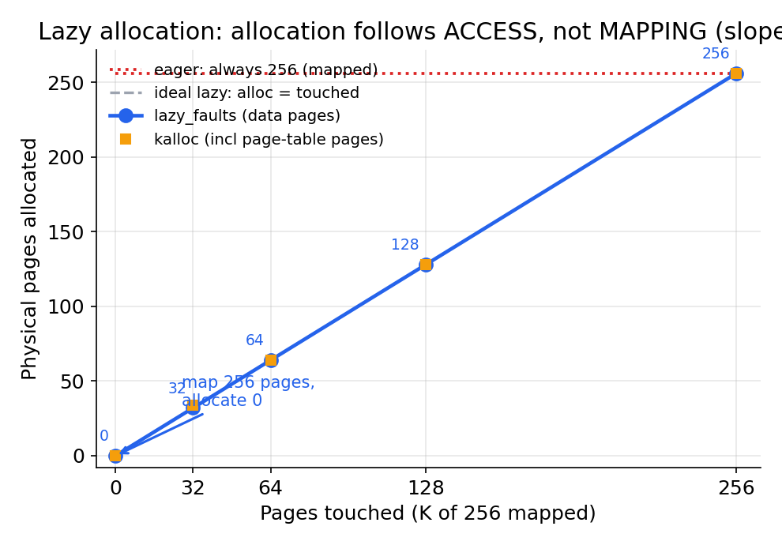
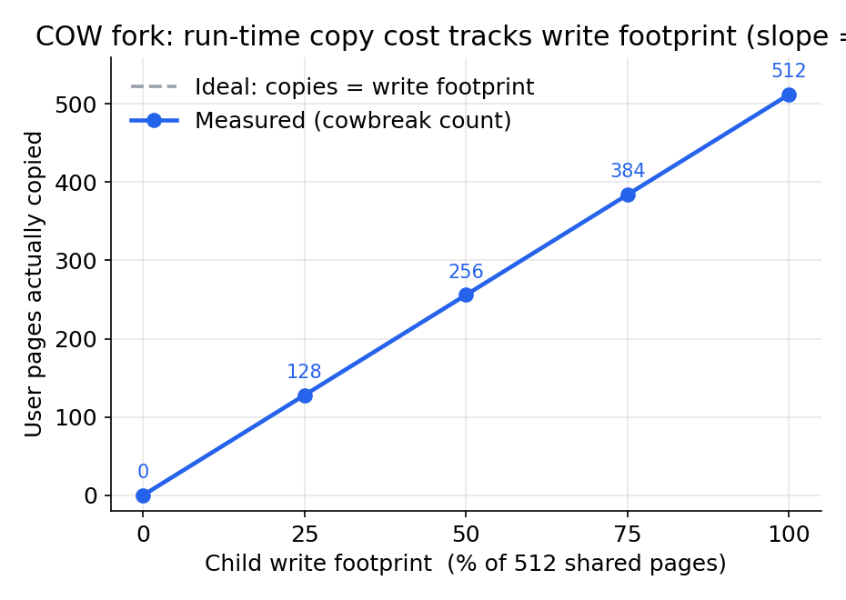
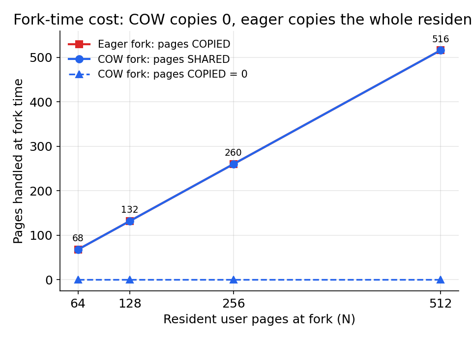
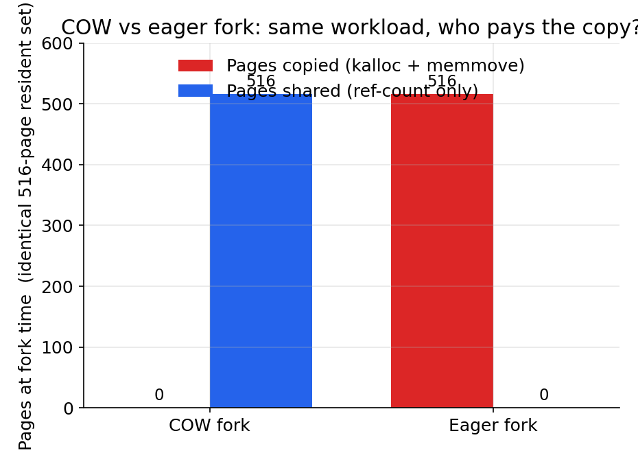
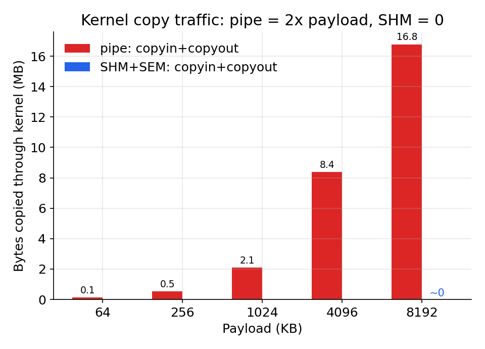
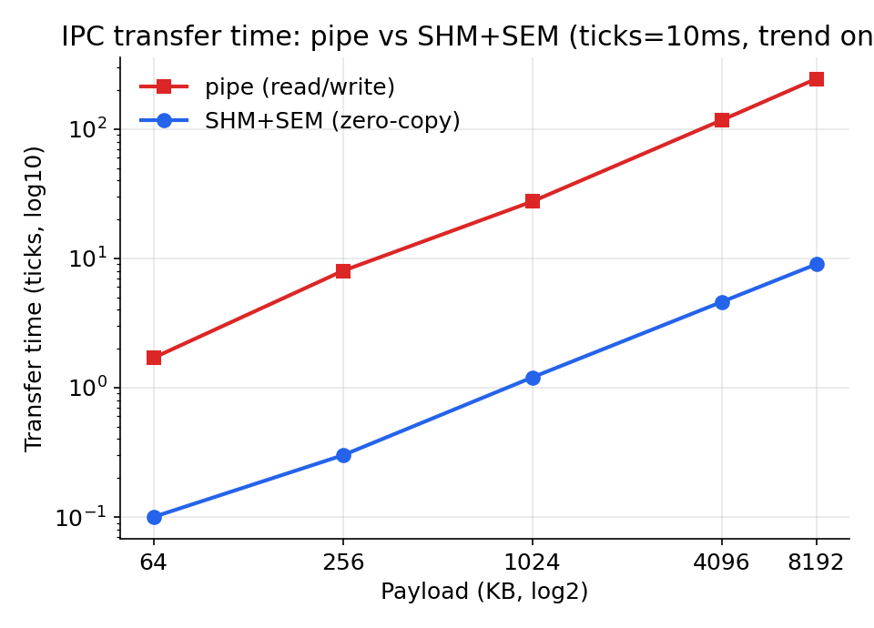
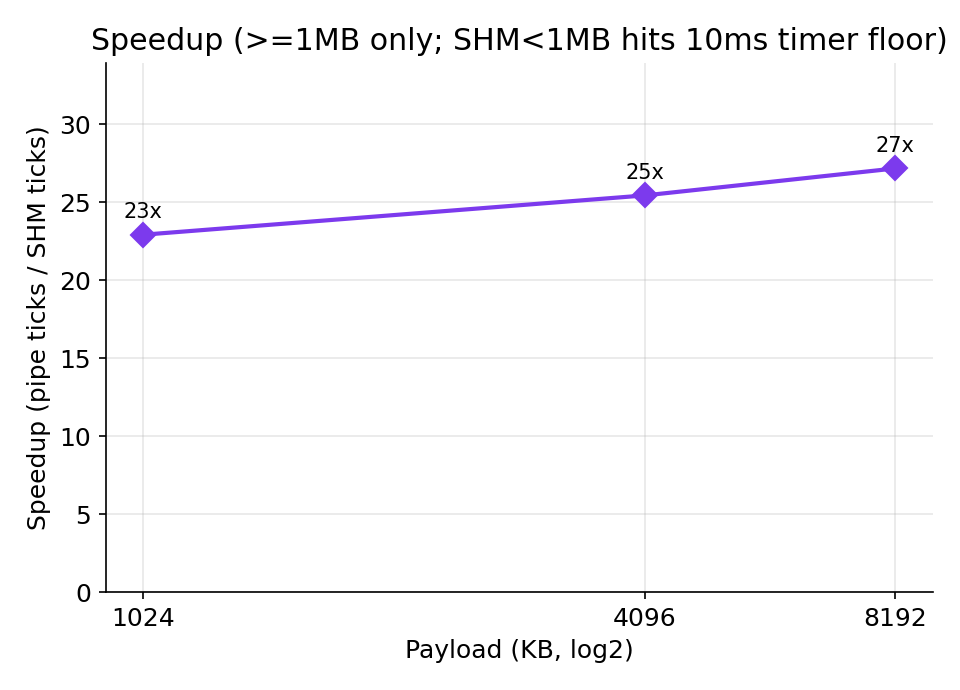
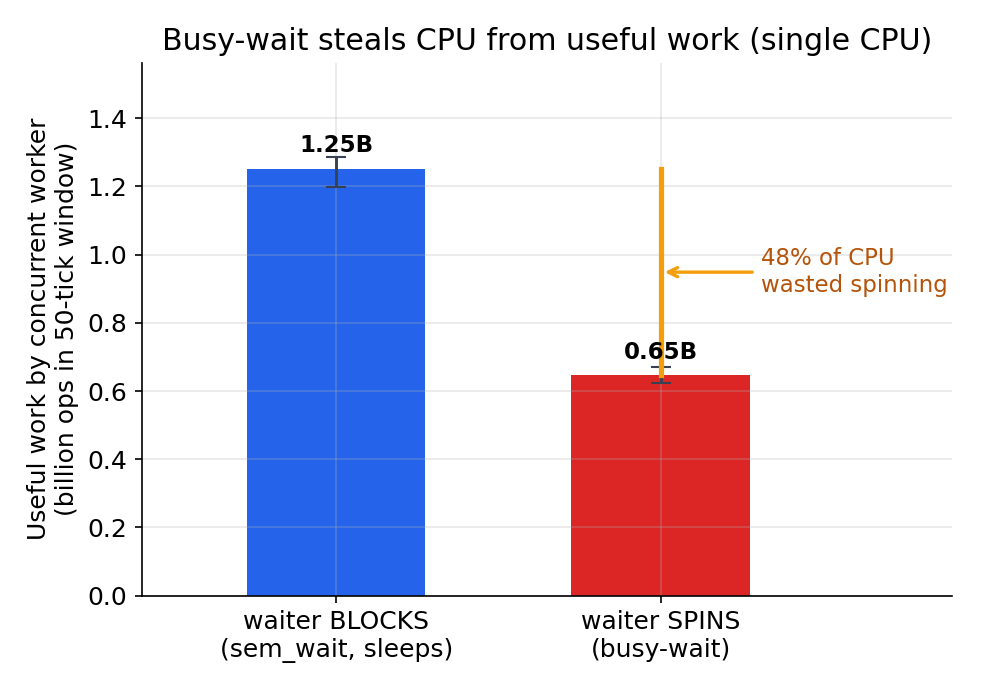
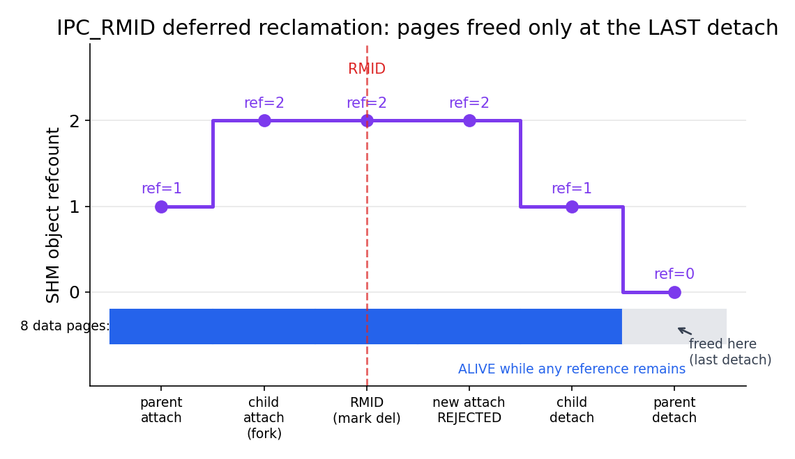

# xv6-VMPlus


> **基于 xv6 的虚拟内存与高效 IPC 扩展**  
> VMA + mmap/munmap + Copy-on-Write fork + Shared Anonymous Memory (SHM) + Blocking Semaphore  
> 目标：在保持 xv6 简洁结构的前提下，让系统在 **fork 可扩展性、零拷贝 IPC、并发同步与资源回收语义** 上更接近真实操作系统。

---

## 目录

- [项目亮点](#项目亮点)
- [快速开始](#快速开始)
- [核心功能](#核心功能)
- [设计与实现总览](#设计与实现总览)
- [系统调用与使用示例](#系统调用与使用示例)
- [代码改动一览](#代码改动一览)
- [实验评估与性能](#实验评估与性能)
- [已知局限与后续计划](#已知局限与后续计划)
- [文档与目录结构](#文档与目录结构)
- [队伍信息](#队伍信息)

---

## 项目亮点

- **统一的虚拟内存抽象（VMA）**：将进程地址空间从单一 `sbrk` 线性堆扩展为可管理的多区域模型
- **mmap/munmap + 懒分配（Lazy Allocation）**：映射时仅记录元数据，首次访问触发缺页后再分配/映射物理页
- **COW fork（写时复制）**：fork 阶段共享物理页，写入时按需拆分；fork 成本更接近“实际写入页数”
- **共享匿名内存（SHM）零拷贝 IPC**：多进程共享同一组物理页，避免 pipe 的双向拷贝开销
- **IPC_RMID 语义与延迟回收**：共享内存“标记删除但不立即释放”，直至最后一个引用释放
- **阻塞信号量同步**：基于 `sleep/wakeup` 的阻塞语义，避免用户态忙等待造成 CPU 浪费

---

## 快速开始

### 依赖

- RISC-V 交叉编译工具链
- QEMU（riscv64）

Ubuntu 示例：

```bash
sudo apt update
sudo apt install -y gcc-riscv64-linux-gnu binutils-riscv64-linux-gnu \
  qemu-system-riscv64 qemu-user
```

### 编译与运行

```bash
# 1) 进入工程目录
cd <your-xv6-project-dir>

# 2) 编译
make clean
make TOOLPREFIX=riscv64-unknown-elf-

# 3) 运行
make qemu

# 4) 退出 QEMU
# Ctrl+a x
```

---

## 核心功能

### 1) VMA + mmap/munmap（匿名映射）

- 地址空间引入 **VMA（Virtual Memory Area）** 数组，记录每段映射的 `[start, end)`、权限、类型（匿名/共享）等元数据
- `mmap` 默认 **不立刻分配物理页**，首次访问触发 page fault 后由 fault handler 分配/映射
- `munmap` 支持对映射区间的 **局部解除映射**：实现中包含“拆分预检查”，保证 VMA 拆分操作的原子性

### 2) COW fork（写时复制）

- `fork` 时不再复制整段用户内存，而是：
  - 父子进程共享同一物理页
  - 清除写权限并设置 COW 标记
  - 引用计数 +1
- 写入 COW 页时触发 **写保护缺页**：
  - 若引用计数为 1：直接恢复可写
  - 否则：分配新页、拷贝内容、更新映射并减少旧页引用计数
- **copyout 也兼容 COW**：避免“内核写用户地址绕过 COW”造成父子进程数据污染

### 3) SHM：共享匿名内存（零拷贝）

- 以 `key` 标识共享匿名对象（对象模型 + 引用计数）
- 支持 **按页懒分配**：对象内部 `pa[i]==0` 表示该页尚未分配，首次访问才分配
- 支持 **IPC_RMID**：删除只是“标记”，禁止新 attach，但老进程仍可访问；引用归零时回收

### 4) 阻塞信号量（与 SHM 配套）

- 面向用户态提供最小 P/V 语义（等待时阻塞），基于内核 `sleep/wakeup`
- 与共享内存配合实现经典 producer-consumer：共享内存负责数据，信号量负责同步

---

## 设计与实现总览

### 缺页处理链（统一入口）

在 `usertrap()` 中对 page fault 进行分流，形成统一的缺页处理链：

```text
写缺页（scause=15）: cowbreak  → vmafault(写) → vmfault
读缺页（scause=13）:            vmafault(读) → vmfault
```

- **优先处理 COW**：否则会把“应复制的共享只读页”误当成普通缺页，破坏隔离语义
- mmap/SHM 与 lazy-heap 共用 fault handler，减少多条分配路径导致的边界条件错误

### 内存安全不变量（关键语义）

- **物理页生命周期独立于页表**：页表销毁只代表解除映射，物理页是否释放取决于引用计数是否归零
- **共享页写入必须可控**：共享状态下页表必须是只读；写入通过缺页异常统一进入复制/拆页逻辑
- **exit/exec/munmap 统一回收语义**：先解除映射，再更新对象引用与物理页引用，避免 freewalk 类崩溃

---

## 系统调用与使用示例

> 说明：不同分支可能函数签名略有差异，以下以“语义解释 + 使用方式”为主，具体以 `user/user.h` 为准。

### mmap：匿名映射 / 共享匿名映射

```c
// 伪代码示例：申请 4 页匿名映射（lazy 分配）
void *p = mmap(0, 4*4096, PROT_READ|PROT_WRITE, MAP_ANON, -1);
memset(p, 0, 4*4096);  // 首次访问触发缺页，按需分配
```

共享匿名映射（key 相同即共享）：

```c
int key = 1;
void *shm = mmap(0, 8*4096, PROT_READ|PROT_WRITE, MAP_ANON|MAP_SHARED, key);
// 父子/两个进程映射同一 key，可实现零拷贝共享
```

### munmap：解除映射

```c
munmap(shm, 2*4096);   // 支持局部解除（可能触发 VMA 拆分）
```

### shmctl：IPC_RMID

```c
shmctl(key, IPC_RMID); // 标记删除：禁止新 attach，引用归零时回收
```

### 信号量（P/V）

```c
sem_wait(semid);  // P：资源不足则阻塞
sem_post(semid);  // V：释放资源并唤醒等待者
```

---

## 代码改动一览


| 模块 | 关键文件 | 主要改动 |
|---|---|---|
| 物理页引用计数 | `kernel/kalloc.c` | 引入 `kref_*`，改造 `kfree()/freerange()`，共享页/COW 页安全回收 |
| COW fork | `kernel/vm.c` | `uvmcopy()` 改为共享+只读+COW；新增 `cowbreak()`；`copyout()` 兼容 COW |
| 懒分配 | `kernel/vm.c` | `vmfault()` 支持 lazy-heap；`vmafault()` 支持 mmap/SHM 按需映射 |
| 缺页分流 | `kernel/trap.c` | `usertrap()` 中按 scause 分流：COW → VMA → lazy-heap |
| mmap/munmap/shmctl | `kernel/sysproc.c` | `sys_mmap/sys_munmap/sys_shmctl`；自动选址；`munmap` split 预检查 |
| 共享内存对象表 | `kernel/shm.c`, `kernel/shm.h` | `NSHM` 对象表、按 key 管理、按页 lazy、IPC_RMID、refcnt 回收 |
| 阻塞信号量 | `kernel/sem.c` | `NSEM` 信号量表、按 key 管理、`sem_open/wait/post`，基于 `sleep/wakeup` |
| 进程生命周期集成 | `kernel/proc.h`, `kernel/proc.c` | `vmas[NVMA]`；fork 复制 VMA 并对 key 去重；`vma_release_all()` + `shm_put` 去重 |
| 系统调用挂接 | `kernel/syscall.c` | 添加 `SYS_mmap/SYS_munmap/SYS_shmctl` 以及 sem 相关接口 |
| 内核级度量与基准 | `kernel/vmstats.c`, `user/*bench.c` | 缺页/拷贝/分配/释放计数器（`cow_faults`/`lazy_faults`/`shm_faults`/`kalloc_cnt`/`kfree_cnt`/`copyin_bytes`/`copyout_bytes`/`fork_copy_pages`/`fork_share_pages`），经 `sys_vmstats` 导出，配套可复现基准程序 |

---

## 实验评估与性能

> **测量方法与可复现性**：所有实验基于内核内置计数器（经 `vmstats()` 系统调用快照求差），多数指标是 **确定性的、与硬件无关的**（缺页数、复制页数、分配/释放页数、拷贝字节数）。每组配置重复多次：确定性指标报告“多次运行完全一致（σ=0）”，调度相关指标报告均值与区间。涉及数据搬运的实验均带 **逐块/逐字节正确性校验**，COW 另带 **资源泄漏检测**。

实验涵盖 README 全部核心特性：

| 特性 | 基准程序 | 实验类型 | 核心结论 |
|---|---|---|---|
| 懒分配 | `lazybench` | 性能/语义 | 物理分配跟随**访问**而非**映射**，分配数严格 = 访问页数 |
| COW fork | `cowbench` | 性能/正确性/泄漏 | 复制量严格 = 写入页数（slope=1）；fork 时复制由 N 降至 0；零泄漏 |
| 零拷贝 IPC | `ipcbench` | 性能/正确性 | 内核拷贝由 pipe 的 2×负载降至 **0** |
| 阻塞信号量 | `semvsbusy` | 调度行为 | 单核下相比忙等回收约 **49%** 被空转浪费的 CPU |
| IPC_RMID 延迟回收 | `rmidbench` | 正确性 | RMID 后拒绝新 attach、老引用仍可访问、最后引用释放才回收 |

---

### 1) 懒分配：分配跟随访问，而非映射

**命题**：`mmap` 256 页，只访问 K 页 → 物理分配恰好 K 页（`mmap` 当下零分配）。`lazy_faults`（数据页按需缺页数）与 `kalloc`（含按需建立的页表骨架）互相印证。

| 映射页 | 访问页 K | `lazy_faults`（数据页） | `kalloc`（数据+页表） |
|---:|---:|---:|---:|
| 256 | 0 | 0 | 0 |
| 256 | 32 | 32 | 32 (+2 页表) |
| 256 | 64 | 64 | 64 |
| 256 | 128 | 128 | 128 |
| 256 | 256 | 256 | 256 |

- `K=0` 行 `kalloc=0`：**映射 256 页但一页物理内存都未分配**，证明 `mmap` 只建立 VMA 元数据。
- `lazy_faults` 严格等于访问页数（slope=1），小 K 时 `kalloc` 多出的极少数页为按需建立的 Sv39 页表骨架页（地址空间一次性建好后不再增长）。

访问页数 vs 分配页数，slope=1， K=0 处零分配



复现：`$ lazy_bench`

---

### 2) COW fork：复制成本 = 实际写入量

三组实验（每组重复 10 次，结果确定 σ=0）：

**实验 A — 运行期复制量随写入量线性（slope=1）。** 父进程驻留 N 页，子进程写入其中前 w 页，统计实际触发的 COW 拆页数（以 N=512 为例，N=128/256 同样成立）：

| 写入比例 | 写入页数 w | 实测复制页数 | 隔离性 |
|---:|---:|---:|:--:|
| 0% | 0 | 1\* | PASS |
| 25% | 128 | 129 | PASS |
| 50% | 256 | 257 | PASS |
| 75% | 384 | 385 | PASS |
| 100% | 512 | 513 | PASS |

\* 恒定 +1 来自子进程**自身栈页**的 COW 拆分。复制量严格 = 写入页数 + 1，斜率严格为 1。隔离性断言：子进程写入后，**父进程读到的数据始终不变**（COW 隔离正确）。

**实验 B — fork 时刻的页处置：COW 复制 0，eager 复制整个驻留集。** 同一驻留集下，对比本项目 COW 实现与原版 xv6 eager 复制（`make qemu EAGER_FORK=1`）：

| 驻留页 N | COW 复制 | COW 共享 | EAGER 复制 | EAGER 共享 |
|---:|---:|---:|---:|---:|
| 64 | 0 | 68 | 68 | 0 |
| 128 | 0 | 132 | 132 | 0 |
| 256 | 0 | 260 | 260 | 0 |
| 512 | 0 | 516 | 516 | 0 |

（共享/复制数比纯 N 略大的常量来自基准进程自身的代码/数据/栈与页表页。）

**实验 C — 资源回收无泄漏。** 连续 500 轮 `fork → 子进程写一半页触发 COW → exit`，内核在用物理页数（`kalloc_cnt - kfree_cnt`）**前后差值 = 0**，零泄漏、零双重释放。

复制量 vs 写入量，三条 N 扫描线压在 slope=1 理想线上



COW vs eager：fork 时复制 0 vs 复制整个驻留集





复现：`$ cow_bench`（COW 内核）；`make qemu EAGER_FORK=1` 后 `$ cow_bench`（eager 基线）

---

### 3) 零拷贝 IPC：Pipe vs SHM+SEM

**命题**：传输 M 字节，两侧用**相同的页对齐分块**搬运同样的数据——pipe 经 `read/write` 两次过内核拷贝，SHM 经 `memmove` 进/出共享环形缓冲、数据不过内核，信号量只传同步信号。消费者**逐块校验**数据，确保两侧都真正搬满每一块。

| 负载 | pipe `copyin` | SHM `copyin` | pipe 耗时(ticks) | SHM 耗时(ticks) |
|---:|---:|---:|---:|---:|
| 64 KB | 65,536 | **0** | 1.7 | 0.1 |
| 256 KB | 262,144 | **0** | 8.0 | 0.3 |
| 1 MB | 1,048,576 | **0** | 27.5 | 1.2 |
| 4 MB | 4,194,304 | **0** | 117.0 | 4.6 |
| 8 MB | 8,388,608 | **0** | 244.5 | 9.0 |

- **核心结论**：pipe 的 `copyin/copyout` 精确等于负载（8MB 即 2×8MB 过内核），**SHM 全程为 0**（`copyout` 仅余 5–40 字节的 `wait()`/`vmstats` 常量噪声）——零拷贝名副其实，且该指标与计时精度无关。
- **共享页复用**：`shm_faults` 恒为 34（16 数据页 + ring 头页等），首次缺页后全程复用、零新增缺页。
- **耗时仅作趋势参考**：ticks 精度为 10ms，大负载下 SHM 耗时已接近计时下限，故时间加速比仅取 ≥4MB 作趋势（约一个数量级），不作为精确指标。
- **正确性**：全部负载逐块校验通过（ALL TRANSFERS VERIFIED）。


内核拷贝量：pipe = 2×负载 vs SHM ≈ 0



传输耗时双线，log-log，趋势相同



加速比，仅 ≥1MB，计时下限为10ms



复现：`$ ipc_bench`

---

### 4) 阻塞信号量 vs 用户态忙等

**命题**：等待时，阻塞信号量让进程**睡眠让出 CPU**，忙等则**空转霸占 CPU**。用一个并发“工作进程”在固定时间窗内的进度，反推它获得的 CPU——等待者阻塞时工作进程吃满 CPU，等待者忙等时两者争抢、工作进程进度腰斩。**需单核运行（`make CPUS=1 qemu`）以制造调度竞争。**

| 场景 | 工作进程进度（窗口内，十亿次操作） |
|---|---:|
| 等待者**阻塞**（`sem_wait` 睡眠） | ≈ 1.25 |
| 等待者**忙等**（自旋轮询） | ≈ 0.65 |

- 阻塞使并发工作进程的有效吞吐 **≈ 1.9×**，即单个忙等进程白白浪费了约 **49%** 的 CPU。
- 忙等者每窗口空转约 **6.25 亿次**（直接可见的浪费）。
- 该比值贴合“单核 + N 个忙等者损失 (N+1)×”的调度理论；属调度行为实验，报告 5 次均值与区间。

阻塞 vs 忙等工作进程进度对比，49% CPU 浪费


 -->

复现：`make CPUS=1 qemu` 后 `$ sem_vs_busy`

---

### 5) IPC_RMID 延迟回收语义

纯正确性实验，验证 System V `IPC_RMID` 的“延迟回收”语义（全部 PASS）：

- **A1**：RMID 标记删除后，新的 attach（`mmap` 该 key）被拒绝。
- **A2**：RMID 后，**已 attach 的进程仍能正常读写**；只要还有引用存在，物理页**不被释放**（验证 `kfree_cnt` 增量为 0）；跨进程的写入对其他 attach 者可见。
- **A3**：**最后一个引用 detach 时才回收**，释放页数与共享数据页数一致。

> 验证了关键安全不变量：物理页生命周期由引用计数决定，而非由某一次 `munmap`/进程退出立即触发；既不提前释放（避免 use-after-free），也不泄漏。

引用计数时间轴：RMID 后页仍存活，最后一个 detach 才回收）

 

复现：`$ rmid_bench`

---

## 已知局限与后续计划

- 当前仅实现匿名映射，**未实现 file-backed mmap**
- VMA 管理采用固定大小数组（可进一步换成链表/平衡树）
- 信号量为最小实现，暂无超时/公平性策略
- **计时精度受限**：耗时类指标基于 `uptime()`（10ms tick），小负载/快操作已接近计时下限，故时间数据仅作趋势参考，核心结论以确定性计数器（拷贝量、复制/分配/释放页数）为准
- 压测规模受 xv6 资源限制，未覆盖极端高并发长时间稳定性场景

---

## 文档与目录结构

### 文档

- [实验文档](docs/实验文档.pdf)
- [函数手册](docs/函数手册.pdf)


---

## 队伍信息

中国海洋大学 | T202510423998043 | 冲刺冲 | “OS原理”赛道 | xv6-VMPlus
